# 汽车销售系统

### 有问题， 或者不会调试的，可以添加微信：xzxj0206

## 一、介绍

汽车销售系统，基于SSM实现的汽车销售系统

### 1、技术实现

后台框架：Spring、SpringMVC、MyBatis

UI界面：JSP、jQuery 、Layui

数据库：MySQL

### 2、系统功能

该汽车销售系统主要分为前台和后台两大功能模块，共包含两种角色，分别是：用户、管理员。

其功能如下：

1.前台功能模块

前台首页、网站公告、推荐商品、特价商品、全部商品、商品搜索、分类展示、汽车浏览、用户登陆、用户注册、个人中心、修改密码、我的订单、我的收藏、购物车、结算付款、查看订单明细、评论留言等功能

2.后台管理模块

后台系统登陆、管理员信息管理、客户信息管理、供应商信息管理、汽车类型管理、汽车信息管理、入库信息管理、订单信息管理、出库信息管理、评价信息管理、网站公告管理等功能

该系统功能完善、界面美观、操作简单、功能齐全、管理便捷，具有很高的实际应用价值。

1）前台首页
2）商品列表
3）商品详情
4）我的订单
5）系统后台登陆
6）客户信息管理
7）汽车类型管理
8）汽车信息管理
9）添加汽车信息
10）订单信息管理

## 二、系统运行界面

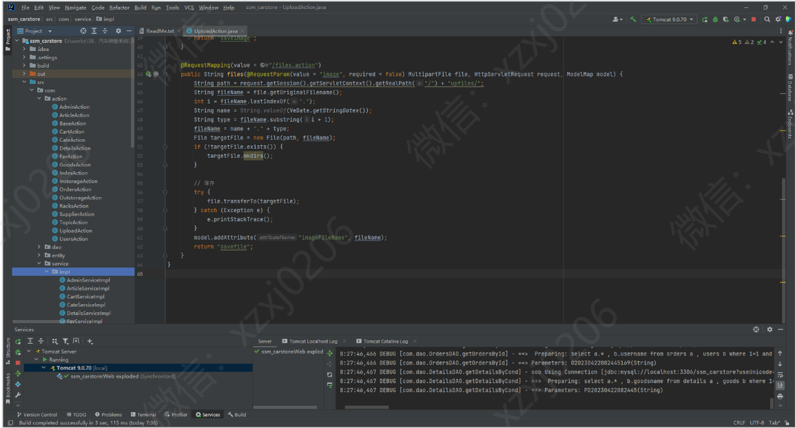

## 三、系统部分功能界面展示

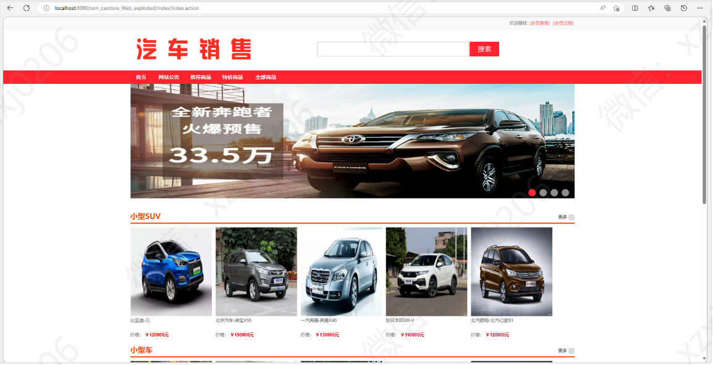

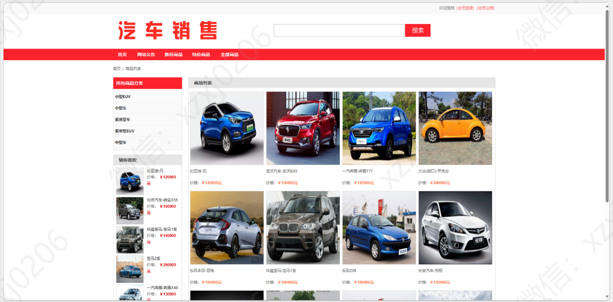

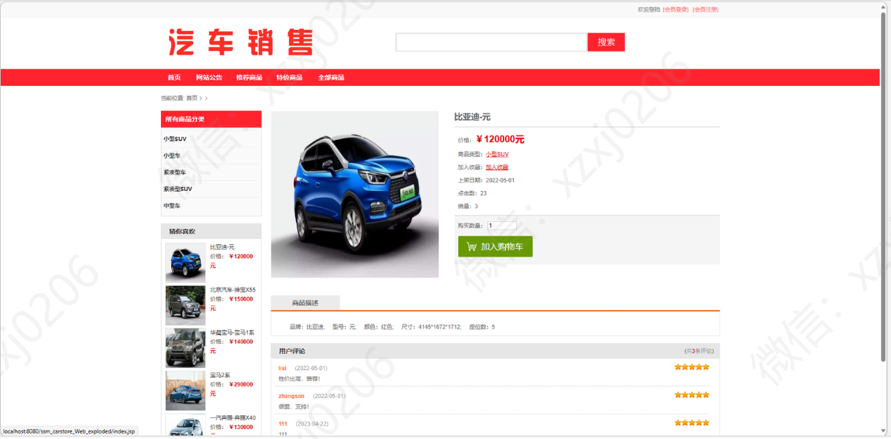

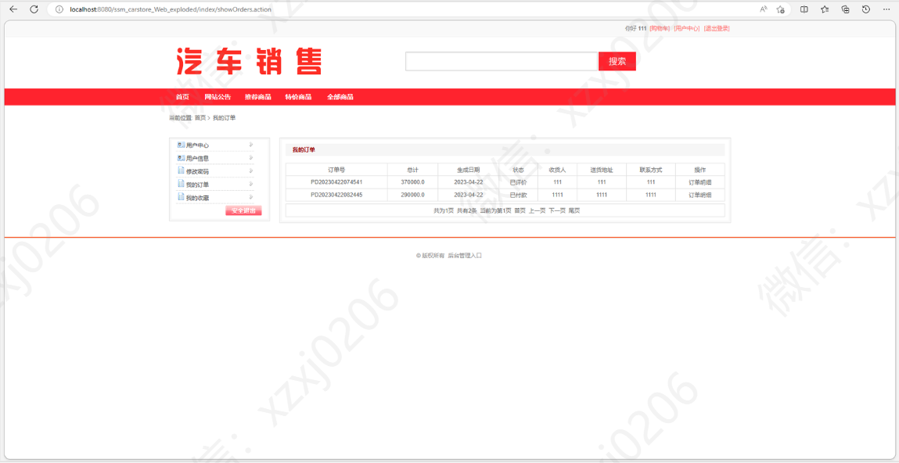

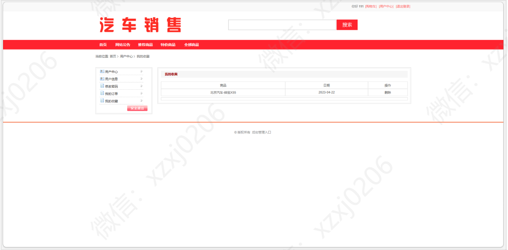

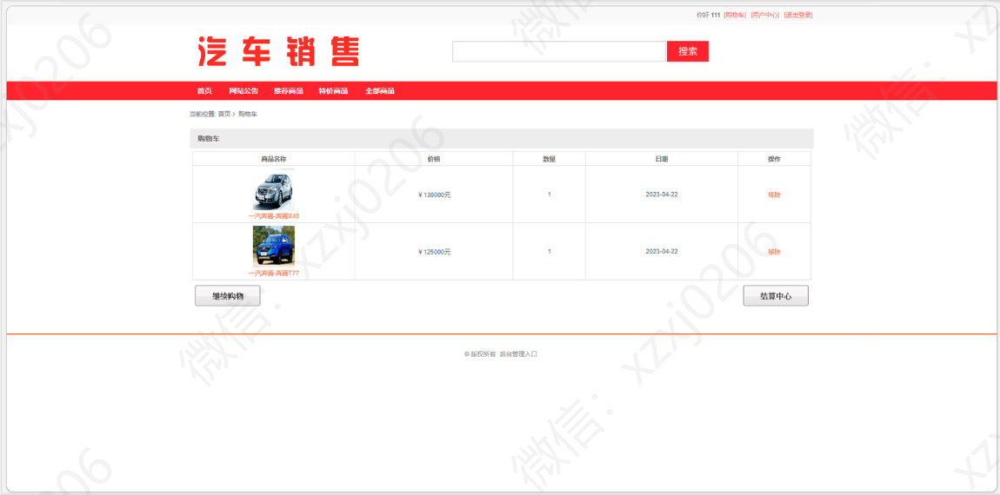

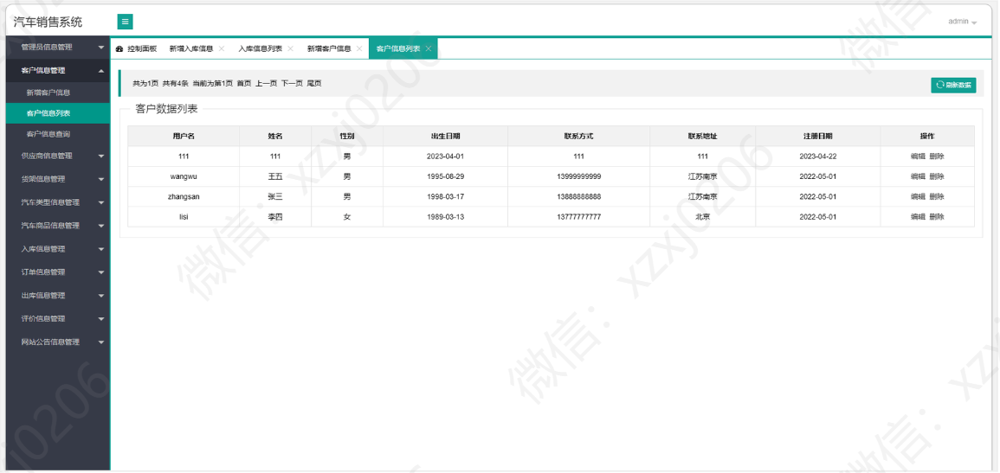

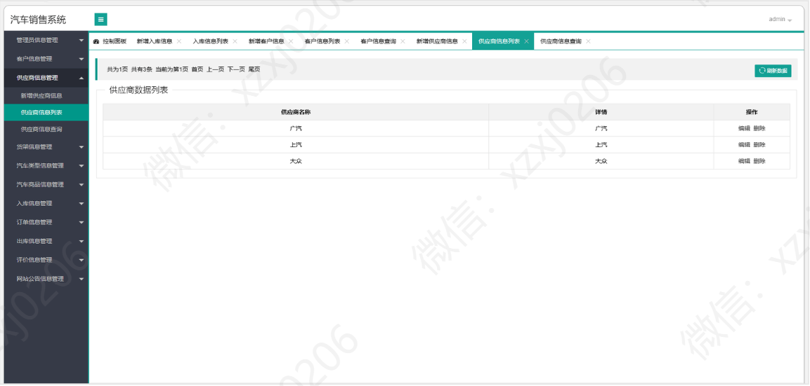

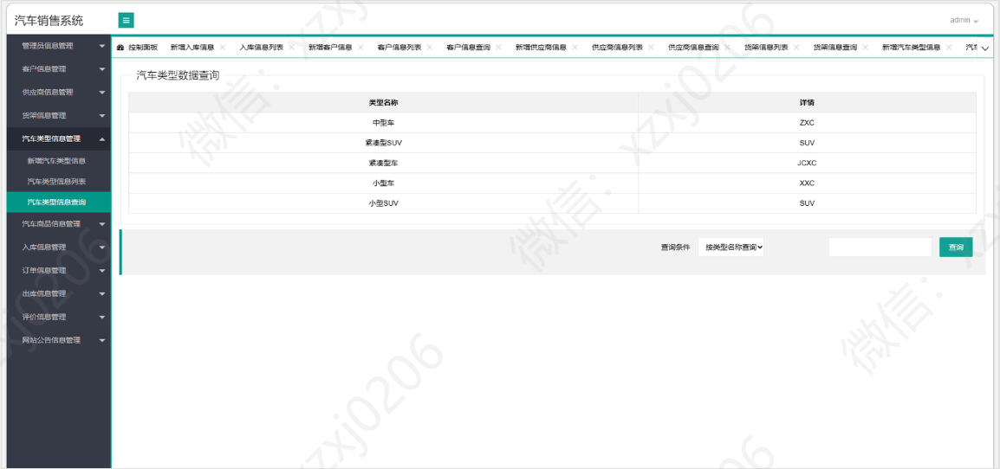

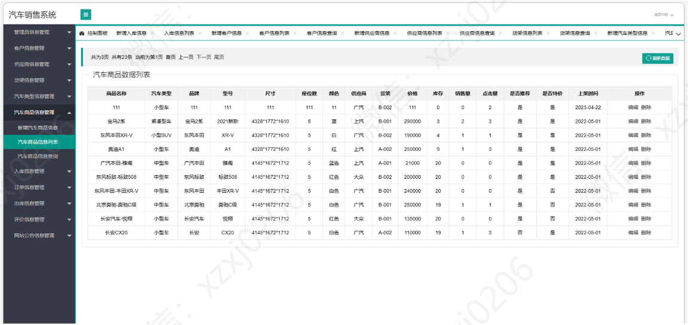

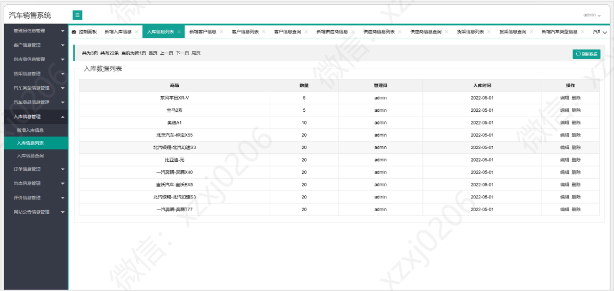

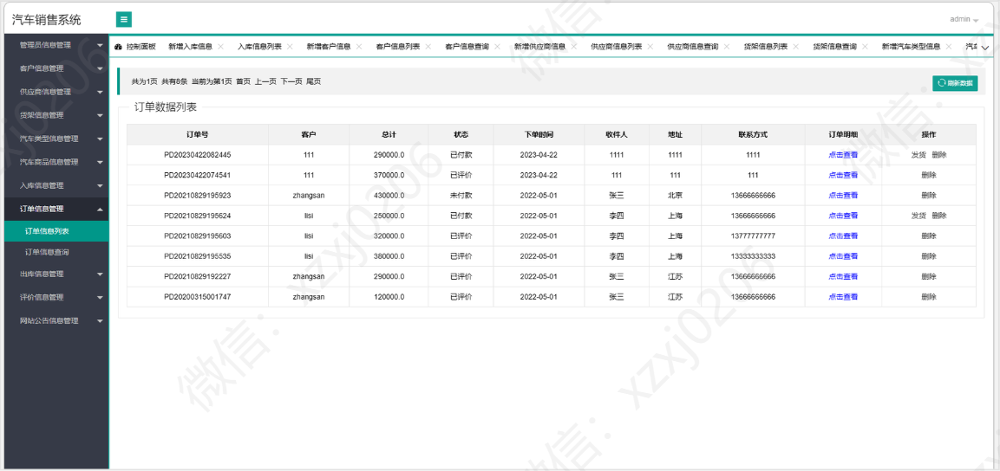

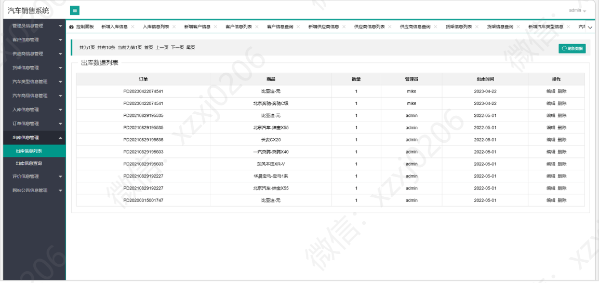

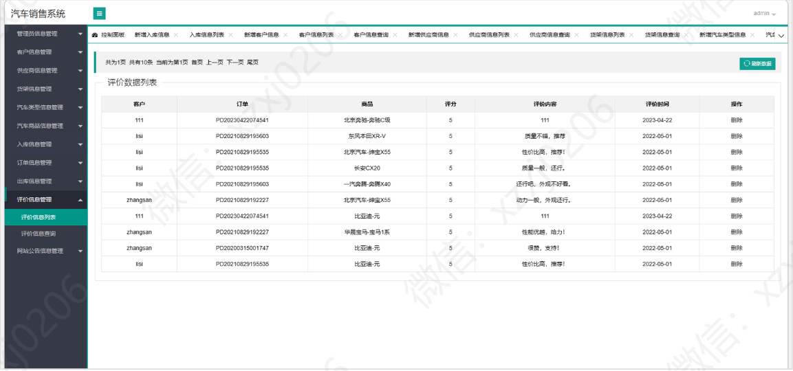
