# 汽车销售系统

## 一、介绍

汽车销售系统，基于SSM实现的汽车销售系统

### 1、技术实现

后台框架：Spring、SpringMVC、MyBatis

UI界面：JSP、jQuery 、Layui

数据库：MySQL

### 完整项目获取

通过网盘分享的文件：汽车销售系统
链接: https://pan.baidu.com/s/1G1a3K5RNagPHwfITlk2QmQ?pwd=pnhf 提取码: pnhf
--来自百度网盘超级会员v3的分享

### 项目合集(项目不断更新中，包含java、vue、python、Android、微信小程序等项目)

链接: https://pan.baidu.com/s/1nY-zhvAK0CXYcn3g7LzQnQ?pwd=id3c 提取码: id3c
--来自百度网盘超级会员v3的分享

### 工具包

链接: https://pan.baidu.com/s/1YmdoJvkjoUjA75wvHLDZ6A?pwd=xm96 提取码: xm96
--来自百度网盘超级会员v3的分享

需要远程项目部署或项目修改和毕业设计也可联系（添加申请时请备注好来意）

### 远程调试部署联系方式

链接: https://pan.baidu.com/s/1W0dDcoZmayG0c7USJDYBYg?pwd=nqd7 提取码: nqd7
--来自百度网盘超级会员v3的分享

#### 这些项目一起发你了 可以分享给你需要的同学 调试可找我 也接二次修改和项目定制、毕业设计等

## 接毕业设计和论文

微信联系方式：xzxj0206  QQ：3808981644   (支持修改、 部署调试、 支持代做毕设)

接网站建设、小程序、H5、APP、各种系统等，单片机、嵌入式也可以做

选题+开题报告+任务书+程序定制+安装调试+论文+答辩ppt  都可以做

### 2、系统功能

该汽车销售系统主要分为前台和后台两大功能模块，共包含两种角色，分别是：用户、管理员。

其功能如下：

1.前台功能模块

前台首页、网站公告、推荐商品、特价商品、全部商品、商品搜索、分类展示、汽车浏览、用户登陆、用户注册、个人中心、修改密码、我的订单、我的收藏、购物车、结算付款、查看订单明细、评论留言等功能

2.后台管理模块

后台系统登陆、管理员信息管理、客户信息管理、供应商信息管理、汽车类型管理、汽车信息管理、入库信息管理、订单信息管理、出库信息管理、评价信息管理、网站公告管理等功能

该系统功能完善、界面美观、操作简单、功能齐全、管理便捷，具有很高的实际应用价值。

1）前台首页
2）商品列表
3）商品详情
4）我的订单
5）系统后台登陆
6）客户信息管理
7）汽车类型管理
8）汽车信息管理
9）添加汽车信息
10）订单信息管理

## 二、系统部分功能界面展示

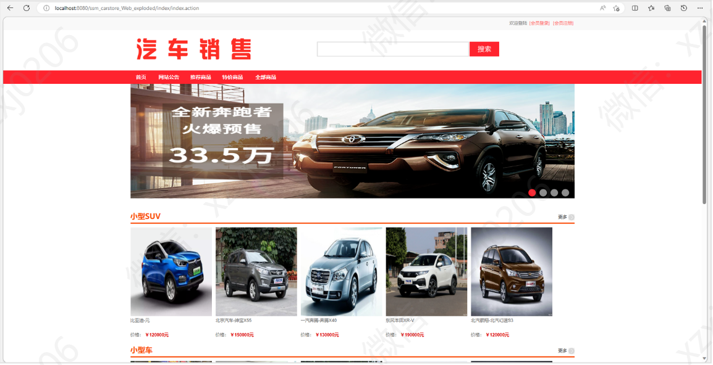

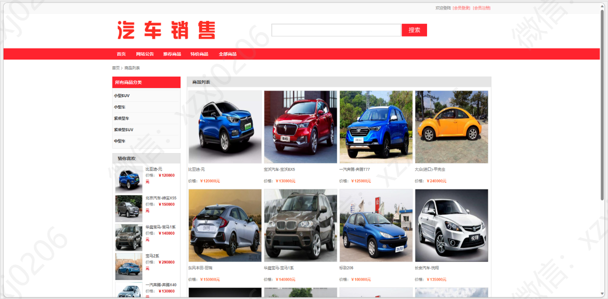

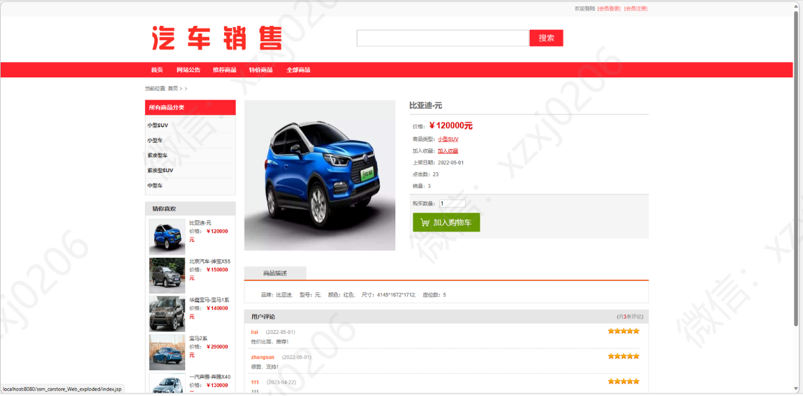

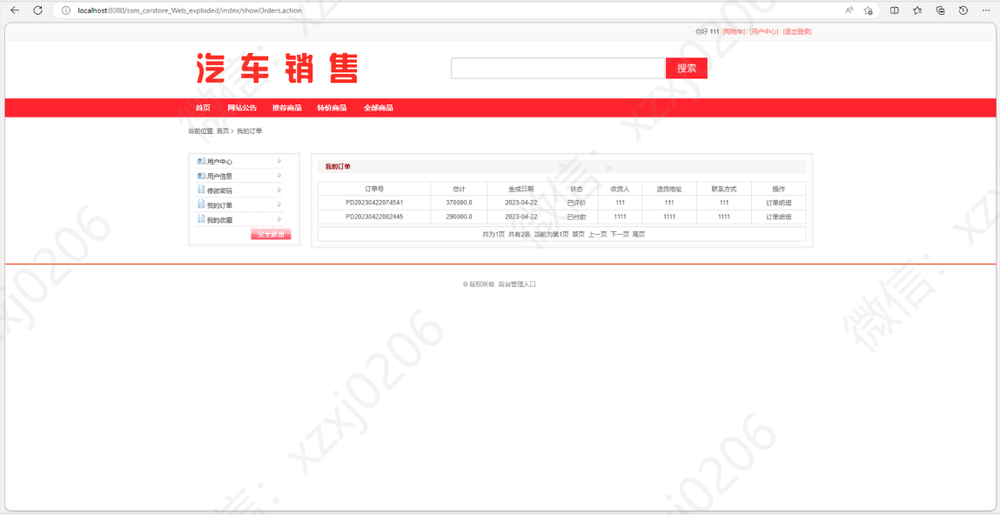

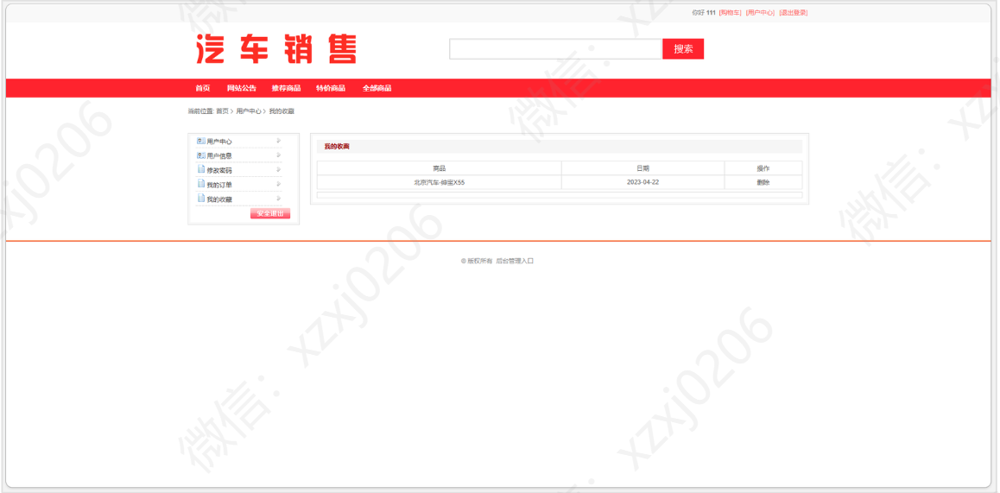

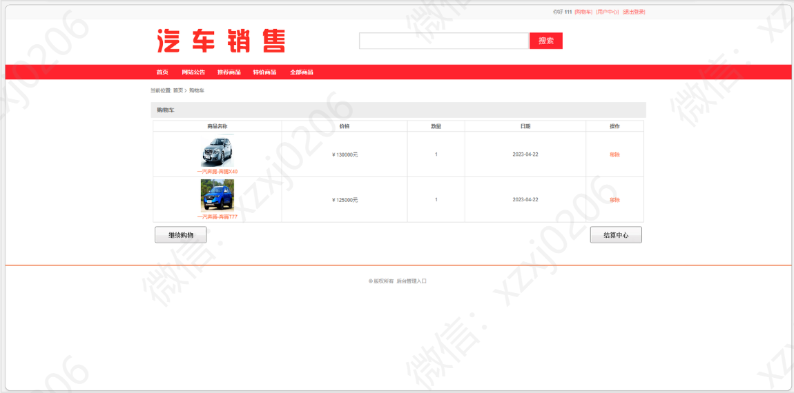

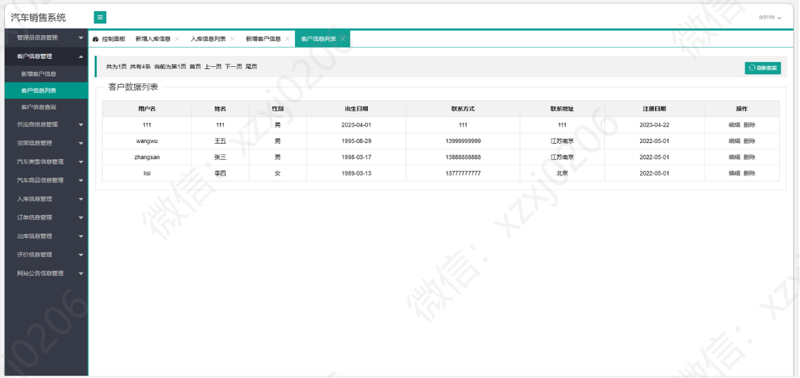

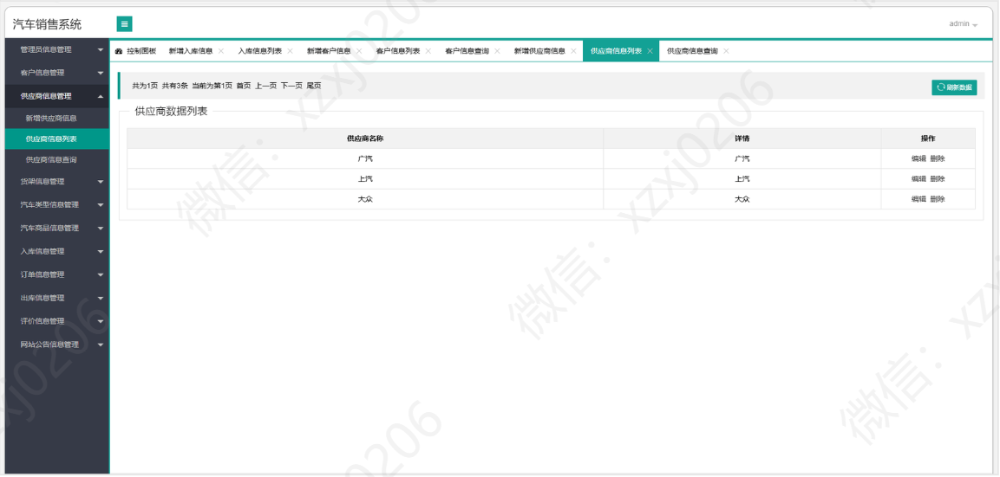

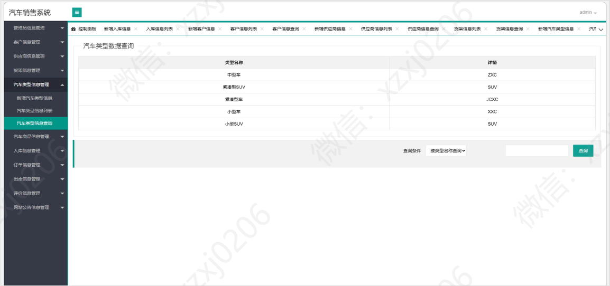

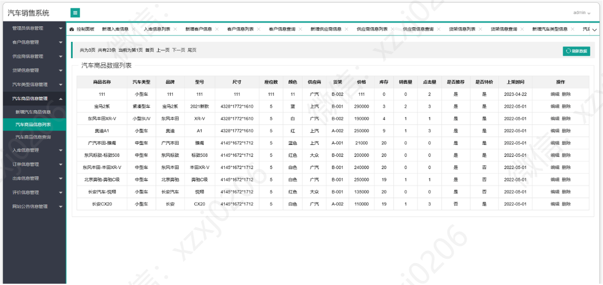

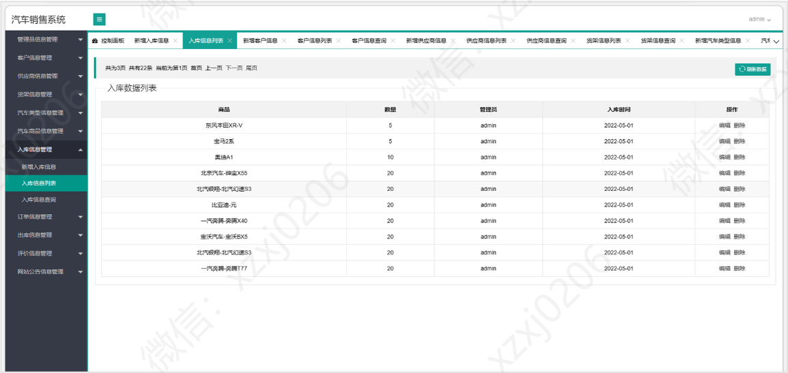

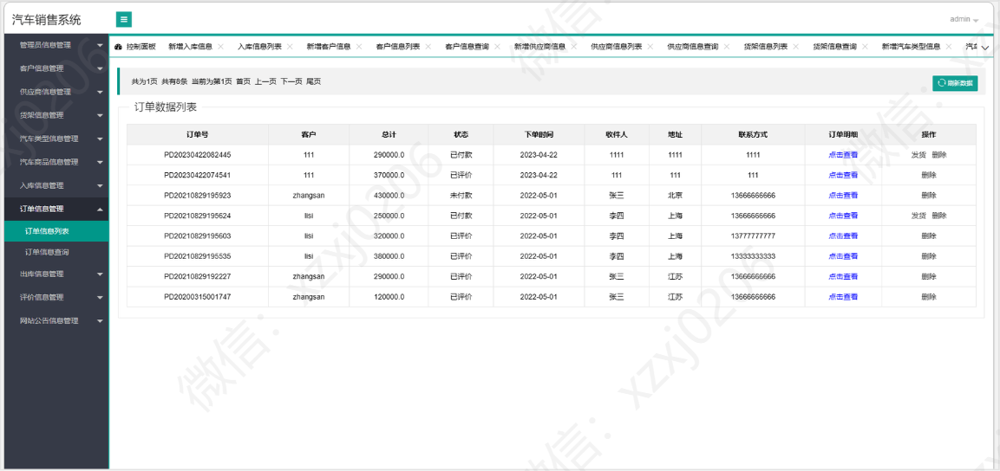

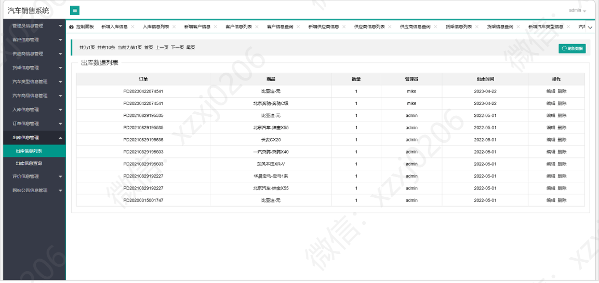

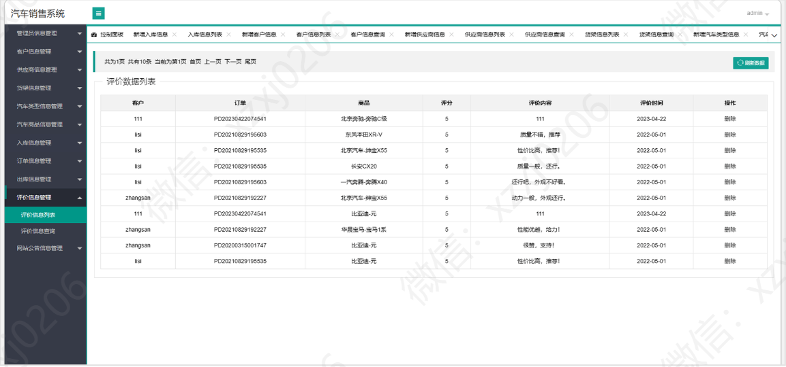

